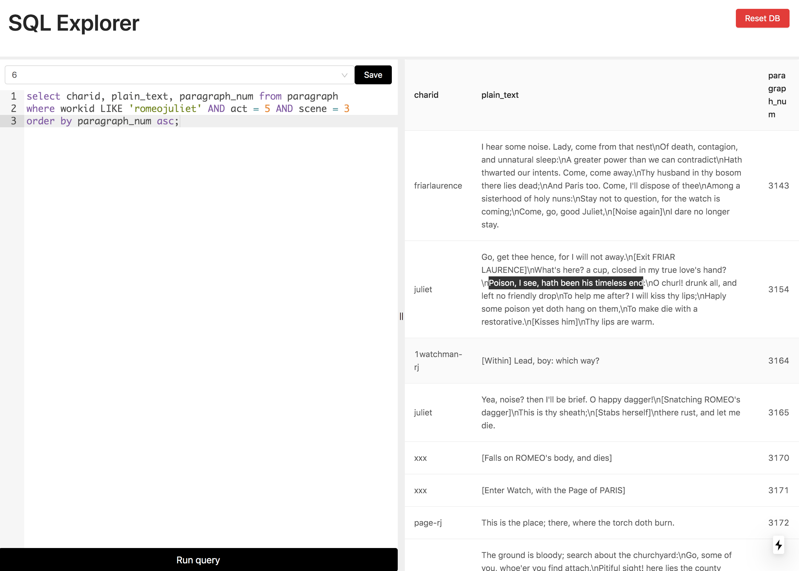

# SQL Front End

A basic UI to run SQL queries against a database, and see the results in a table.
You can also save your favorite queries for later use (stored in local storage).

When clicking "Reset DB", the database is filled with Shakespeare. The tables available are `work`, `character`, `chapter`, and `paragraph`.




> You can actually read some Shakespeare if you want, but it's quite dramatic, so be careful.

## Instructions
This project is dependent on a postgres instance running on port 5432.


To get this up and running easily you can follow these steps:

1. Install [docker](https://docs.docker.com/desktop/) and [docker-compose](https://docs.docker.com/compose/install/)
2. Run `docker-compose up` in the same folder as `docker-compose.yml` (the root folder)
3. To start the frontend run `yarn` and then `yarn dev`
3. Go to `localhost:3000` and cick the "Reset DB" button to start with a freshly populated data base.


This is a [Next.js](https://nextjs.org/) project bootstrapped with [`create-next-app`](https://github.com/vercel/next.js/tree/canary/packages/create-next-app).

## Getting Started

First, run the development server:

```bash
npm run dev
# or
yarn dev
```

Open [http://localhost:3000](http://localhost:3000) with your browser to see the result.

You can start editing the page by modifying `pages/index.js`. The page auto-updates as you edit the file.

## Learn More

To learn more about Next.js, take a look at the following resources:

- [Next.js Documentation](https://nextjs.org/docs) - learn about Next.js features and API.
- [Learn Next.js](https://nextjs.org/learn) - an interactive Next.js tutorial.

You can check out [the Next.js GitHub repository](https://github.com/vercel/next.js/) - your feedback and contributions are welcome!

## Deploy on Vercel

The easiest way to deploy your Next.js app is to use the [Vercel Platform](https://vercel.com/import?utm_medium=default-template&filter=next.js&utm_source=create-next-app&utm_campaign=create-next-app-readme) from the creators of Next.js.

Check out our [Next.js deployment documentation](https://nextjs.org/docs/deployment) for more details.
